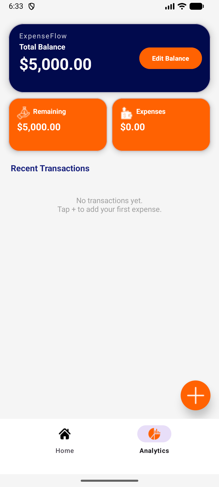
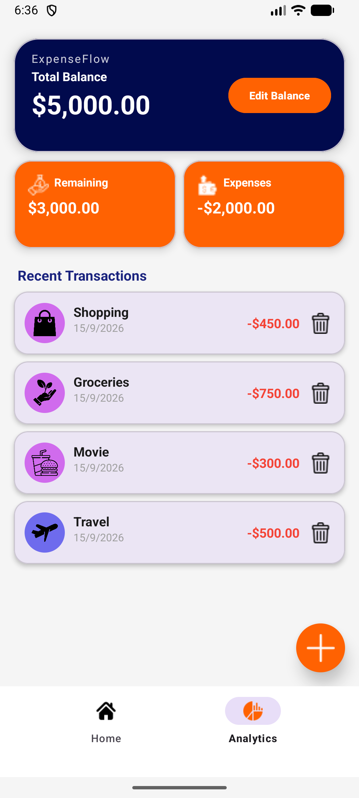
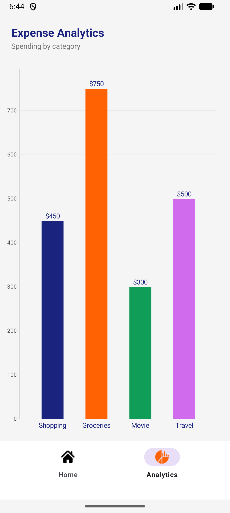
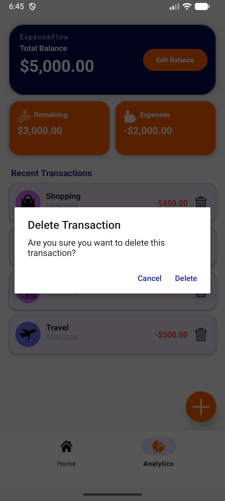

# ExpenseFlow 💳📊

**ExpenseFlow** is a modern, intuitive personal finance and expense tracking Android application built using **Kotlin**, **Android Jetpack**, **Room Database (MVVM)**, and **MPAndroidChart**. It allows users to set budgets, log categorized expenses with custom colors and dates, track spending in real-time, and analyze spending habits with interactive charts.

---

## 🚀 Features

- 💰 **Total Balance & Budget Tracking:** Set custom total balance with instant real-time computation of remaining balance and total expenses.
- ➕ **Fast Expense Logging:** Add expenses with custom titles, amounts, customizable category icons, color picker (`AmbilWarna`), and a native DatePicker.
- 🗃️ **Offline-First Room Persistence:** All transactions are stored locally using Android Room SQLite with MVVM architecture (`ViewModel`, `Repository`, `Dao`).
- 🗑️ **Transaction Management:** Real-time list updates with delete confirmation dialogs and automatic recalculations.
- 📊 **Visual Analytics:** Interactive bar charts powered by **MPAndroidChart** to visualize expenses by category.
- 🎨 **Modern Material 3 Design:** Polished Indigo & Orange color palette with responsive cards and bottom navigation.

---

## 📸 Screenshots

| Dashboard (Empty) | Dashboard (Transactions) |
|:---:|:---:|
|  |  |

| Expense Analytics | Delete Confirmation |
|:---:|:---:|
|  |  |

---

## 🛠️ Tech Stack & Architecture

- **Language:** Kotlin (100%)
- **Architecture:** MVVM (Model - View - ViewModel)
- **Database / Storage:** Android Room SQLite + Shared Preferences
- **Asynchronous / Concurrency:** Kotlin Coroutines (`Dispatchers.IO`, `Dispatchers.Main`, `viewModelScope`)
- **UI Components:** Android Jetpack, Material Design 3, ConstraintLayout, RecyclerView, MaterialCardView, BottomNavigationView
- **Libraries:**
  - `MPAndroidChart` (Data Visualization)
  - `AmbilWarna` (Color Picker Dialog)
  - `AndroidX Lifecycle` & `ViewModel KTX`
  - `AndroidX Room KTX` & `Kapt`

---

## 📱 Application Flow

1. **Dashboard (`MainActivity`):**
   - View Total Balance, Remaining Amount, and Total Expenses.
   - "Edit Balance" allows updating initial capital.
   - List of recent transactions with category icons, colored badges, dates, and delete actions.
   - Floating Action Button to log new transactions.
2. **Add Expense (`AddExpenses`):**
   - Enter expense amount and category name.
   - Select category icon (Food, Travel, Healthcare, Shopping, Education, Agriculture, Home).
   - Customize badge color with interactive color picker palette.
   - Select transaction date.
3. **Analytics (`Graph`):**
   - Visual bar chart displaying expense distribution per category.
   - Empty-state indicator when no transactions exist.

---

## 📦 Project Setup & Build

1. Open project in **Android Studio (Ladybug / Iguana or later)**.
2. Sync Gradle files (`build.gradle.kts` and `settings.gradle.kts`).
3. Ensure JDK 17+ is configured for Gradle.
4. Run on an Android Device or Emulator (API 24+ supported, Target API 34).

```bash
# Build Debug APK
./gradlew assembleDebug
```
The resulting APK is generated at:
`app/build/outputs/apk/debug/app-debug.apk`

---

## 📄 Submission Information

- **Project Name:** ExpenseFlow – Personal Expense Management App
- **Platform:** Android / Kotlin
- **Student Name:** Maharsh Patel
- **Enrollment No.:** 24012011102
- **Batch:** H-1
- **Branch:** CE
- **Semester:** 5th
- **Submission Date:** September 2026
